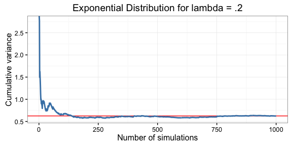

Overview
--------

In this report, we will investigate the exponential distribution in R
and compare our findings with the Central Limit Theorem. To do so, we
will first review both concepts.

Recall that an exponential distribution is often used to model the time
elapsed between events (the rate), where the rate parameter is specified
as lambda. The theoretical mean of an exponential distribution is
1/lambda and the theoretical standard deviation is also 1/lambda. The
probability density function looks something like:

The Central Limit Theorem states that the distribution of means for any
statistic approaches a standard normal distribution as the sample size
increases.

We will use R to simulate several exponentially distributed samples,
compare some statistics derived from the samples to their theoretical
counterparts, and explore the distribution of the mean of the
exponentials.

Simulation
----------

First, let's simulate some exponentials with a rate of .2 using the
following R snippet:

    set.seed(22)
    # set up 1000 simulations each with a sample size of 40
    sampleSize <- 40
    simulationCount <- 1000
    # set lambda (the rate parameter)
    lambda = 0.2
    # run the simulation and store the result in simulationData
    simulationData <- matrix(rexp(sampleSize*simulationCount, lambda), 
                             nrow = simulationCount, ncol = sampleSize )

Sample vs Theoretical
---------------------

Before we begin our analysis, let's make the interpretation a little
more interesting by turning our simulation into a hypothetical scenario.
Suppose demand for data scientists has grown so high that this
simulation models the waiting time for the next occurrence of a data
scientist being offered a job. Also suppose that the rate is expressed
in days. Therefore, the mean of each row of our data set represents the
average time that a data scientist in that sample of 40 data scientists
will wait before being offered another job.

Since we know that the theoretical mean of an exponential distribution
is 1/lambda, and we have specified that lambda is .2, we can determine
that the theoretical mean for our distribution is 5. Therefore, we would
expect a data scientist to wait 5 days before being offered another job.
The plot below shows the comparison of cumulative mean from the
simulation trials (blue line) to the population mean (red line at y =
5):

    ## Warning: package 'ggplot2' was built under R version 3.2.3

As we can see from above, the sample mean approaches the population mean
of 5 as the number of simulations increases. Similarly, we would expect
to see the sample variance tend toward the theoretical variance, which
we calculate to be .625 (1/lambda^2\*40).

The plot below shows the comparison of cumulative variance from the
simulation trials (blue line) to the population variance (red line at y
= .625):

Sample Mean Density
-------------------

Now, let's review the density function for our sample means. According
to the Central Limit Theorem, we expect a normal distribution centered
at the population mean, which is 5.

By overlaying the normal distribution (red dotted line) on our
distribution function, we can distinctly see that the distribution for
our sample means follows the normal distribution. We can also recognize
that the sample mean (in cyan) is very close to the theoretical
population mean (in red), which is 5.

Using R, we were able to create a simulation that verifies the
assertions of the Central Limit Theorem. With just 1000 simulations of a
sample size of 40, we were able to confirm that the sample mean and
variance converge toward their theoretical counterparts. We were also
able to recognize that the sample mean follows the normal distribution.
